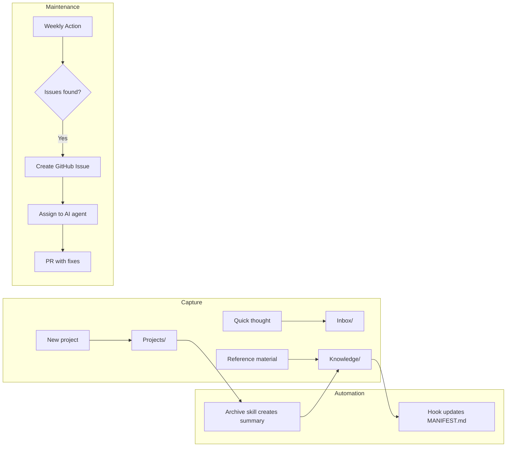
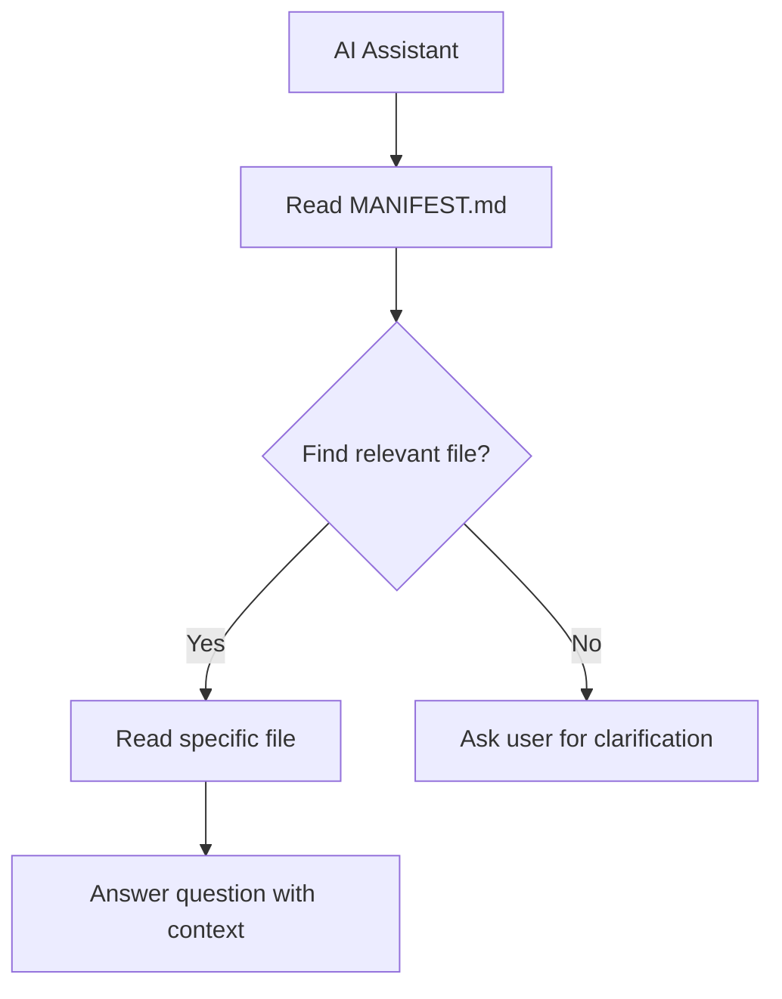
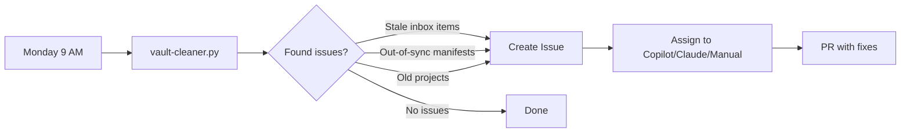

# Minimal Second Brain

[](https://github.com/gokhanarkan/minimal-second-brain/actions/workflows/tests.yml)

A simple, AI-native knowledge management system for Obsidian.

Three folders. Zero templates. Works seamlessly with Claude Code, GitHub Copilot, and other AI assistants.

## Quick Start

1. Click **"Use this template"** to create your own repository
2. Clone it and open in Obsidian
3. Start capturing notes

That's it. The automation handles the rest.

## Architecture

```
minimal-second-brain/
├── .claude/
│   ├── hooks/
│   │   └── update-manifest.py    # Auto-updates MANIFEST.md on file changes
│   ├── settings.local.json       # Hook configuration for Claude Code
│   └── skills/
│       └── archive-project/      # AI skill for archiving completed projects
│           └── SKILL.md
├── .github/
│   ├── copilot-instructions.md   # Quick reference for GitHub Copilot
│   ├── scripts/
│   │   └── vault-cleaner.py      # Detects stale items and manifest issues
│   └── workflows/
│       └── vault-cleaning.yml    # Weekly maintenance automation
├── Personal/                     # Example pillar (duplicate for Work/, Studies/, etc.)
│   ├── Inbox/                    # Quick captures, process later
│   ├── Projects/                 # Active work with deadlines
│   ├── Knowledge/                # Reference, ideas, concepts
│   │   └── MANIFEST.md           # Auto-generated index for AI discovery
│   ├── CLAUDE.md                 # Pillar-specific Claude instructions
│   └── AGENTS.md                 # Pillar-specific universal agent instructions
├── .gitignore                    # Excludes Obsidian cache and OS files
├── AGENTS.md                     # Root-level universal agent instructions
├── CLAUDE.md                     # Root-level Claude Code instructions
├── LICENSE                       # MIT licence
└── README.md
```

## How It Works



### The Manifest System

AI assistants read `MANIFEST.md` to understand your knowledge without scanning every file:



## Example Use Cases

Your second brain becomes powerful when AI can query your personal knowledge:

### Health & Insurance

```
You: "When does my dental insurance renew?"
AI: *reads Knowledge/Health Insurance.md*
    "Your dental cover renews on 1st April 2025.
     You have £150 remaining from your £500 annual limit."

You: "Can I claim for a white filling?"
AI: *reads Knowledge/Health Insurance.md*
    "Yes, white fillings are covered up to £180 per tooth
     under your current policy. You've claimed £85 this year."
```

### Work Context

```
You: "What feedback did I give Sarah in our last 1:1?"
AI: *reads Projects/Team 1-1s.md*
    "On Dec 15th, you discussed her API refactoring work.
     You suggested she document the breaking changes better
     and praised her test coverage improvements."

You: "Help me write my self-assessment"
AI: *reads git history + Projects/*
    "Based on your commits and project notes, here are your
     key achievements this quarter: shipped 3 features,
     mentored 2 junior engineers, reduced API latency by 40%..."
```

### Personal Planning

```
You: "What are my goals for Q1?"
AI: *reads Knowledge/2025 Goals.md*
    "Your Q1 focus areas are:
     1. Complete thesis literature review
     2. Ship the auth feature at work
     3. Run 3x per week consistently"

You: "Archive the kitchen renovation project"
AI: *creates Knowledge/Kitchen Renovation (Archived).md*
    *stores commit hash for restoration*
    *deletes original project file*
    "Done. Summary saved with £12,400 final cost and contractor notes."
```

## Adding Pillars

The template includes one pillar (`Personal/`). To add more:

1. Duplicate the `Personal/` folder
2. Rename it (e.g., `Work/`, `Studies/`)
3. Update the `CLAUDE.md` and `AGENTS.md` inside
4. Update root `CLAUDE.md` to list your pillars

The automation scripts auto-detect pillars. Any folder with `Inbox/`, `Projects/`, or `Knowledge/` is treated as a pillar.

## Automation

### Manifest Updates (Claude Code)

The `.claude/hooks/update-manifest.py` hook automatically updates `MANIFEST.md` whenever you create or edit files in `Knowledge/`.

Requires [Claude Code](https://claude.ai/claude-code) with hooks enabled.

### Project Archiving (Claude Code)

Say "archive the project" and Claude will:
1. Create an AI-generated summary in `Knowledge/`
2. Store the git commit hash for restoration
3. Delete the original project file

### Weekly Cleaning (GitHub Actions)



A GitHub Action runs every Monday and checks for:
- Out-of-sync manifests
- Inbox items older than 3 days
- Stale projects (30+ days)

If issues are found, it creates a GitHub Issue with detailed instructions. You can:
- **Assign to Copilot** - GitHub Copilot coding agent will create a PR
- **Assign to Claude** - Use Claude Code to work on the issue
- **Handle manually** - Follow the instructions yourself

No special tokens or configuration needed.

## Customisation

| Setting | File | Default |
|---------|------|---------|
| Inbox threshold | `.github/scripts/vault-cleaner.py` | 3 days |
| Stale project threshold | `.github/scripts/vault-cleaner.py` | 30 days |
| Cleaning schedule | `.github/workflows/vault-cleaning.yml` | Monday 9 AM UTC |

## AI Instructions

The vault includes instruction files for AI assistants:

| File | Purpose |
|------|---------|
| `CLAUDE.md` | Claude Code instructions |
| `AGENTS.md` | Universal agent instructions (works with any AI) |
| `.github/copilot-instructions.md` | GitHub Copilot quick reference |

### Choosing Your AI Instructions

The template includes multiple formats. **You don't need all of them.**

| If you use... | Keep | Delete |
|---------------|------|--------|
| Claude Code only | `CLAUDE.md` | `AGENTS.md`, `copilot-instructions.md` |
| GitHub Copilot only | `copilot-instructions.md` | `CLAUDE.md`, `AGENTS.md` |
| Multiple AI tools | All files | - |
| Other AI agents | `AGENTS.md` | `CLAUDE.md`, `copilot-instructions.md` |

**CLAUDE.md** - Detailed, Claude Code-specific instructions with hooks integration.

**AGENTS.md** - Universal format following the [agents.md spec](https://agents.md). Works with Cursor, Codex, Windsurf, and 25+ other AI coding tools.

**copilot-instructions.md** - Quick reference for GitHub Copilot.

Pick one and delete the rest. Less clutter, same functionality.

## Philosophy

1. **Capture without friction** - No templates, no decisions
2. **Projects as workspaces** - Self-contained folders for active work
3. **Knowledge is discoverable** - Manifests let AI navigate your notes
4. **Automation disappears** - Maintenance happens in the background

## Licence

MIT
