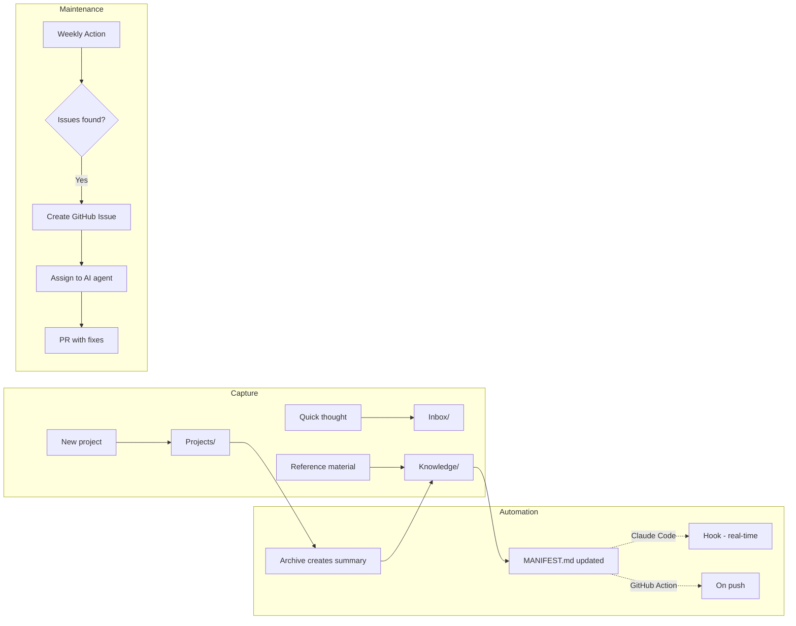
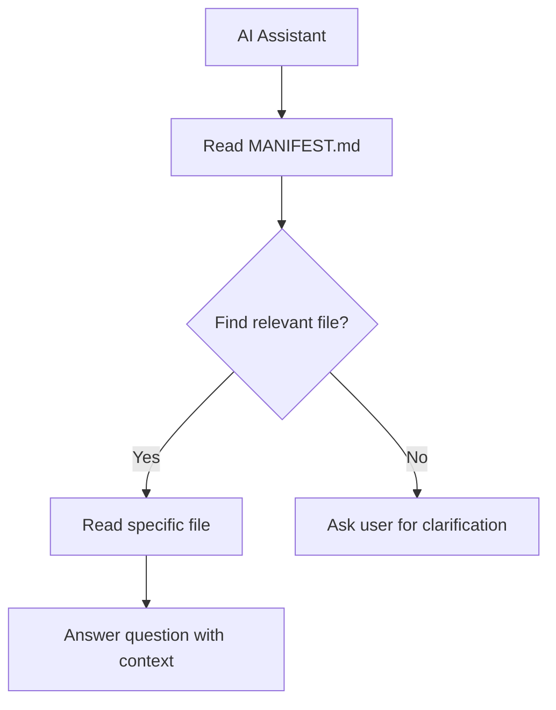
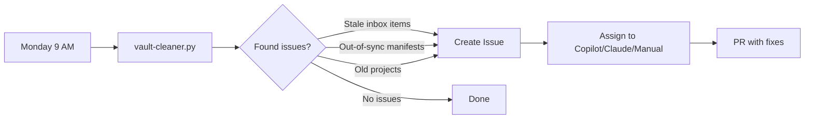

# Minimal Second Brain

[](https://github.com/gokhanarkan/minimal-second-brain/actions/workflows/tests.yml)

A simple, AI-native knowledge management system for Obsidian.

Three folders. Zero templates. Works seamlessly with Claude Code, GitHub Copilot, and other AI assistants.

## Quick Start

1. Click **"Use this template"** to create your own repository
2. Clone it and open in Obsidian
3. Start capturing notes

That's it. The automation handles the rest.

## Why This Approach

**Why Obsidian?** Plain markdown files in folders. No vendor lock-in. If Obsidian disappears, open the same files in VS Code or any text editor. iCloud syncs to your phone. Git tracks changes. AI assistants can read and edit plain text directly.

**Why not Claude Projects?** Your knowledge isn't static. You update notes, revise goals, add meeting summaries. Claude Projects are snapshots. This system is a flowing river with version history and offline access.

**Why AI-native?** As of 2025, AI assistants are better at finding, reading, and summarising your notes than you are. Let them handle retrieval and synthesis while you focus on capture and organisation.

## Architecture

```
minimal-second-brain/
├── .claude/
│   ├── hooks/
│   │   └── update-manifest.py    # Auto-updates MANIFEST.md on file changes
│   ├── settings.local.json       # Hook configuration for Claude Code
│   └── skills/
│       ├── archive-project/      # AI skill for archiving completed projects
│       │   └── SKILL.md
│       └── github-summary/       # AI skill for summarising GitHub activity
│           └── SKILL.md
├── .github/
│   ├── copilot-instructions.md   # Quick reference for GitHub Copilot
│   ├── scripts/
│   │   ├── sync-manifests.py     # Regenerates all MANIFEST.md files
│   │   └── vault-cleaner.py      # Detects stale items and manifest issues
│   └── workflows/
│       ├── manifest-sync.yml     # Auto-sync manifests on push
│       └── vault-cleaning.yml    # Weekly maintenance automation
├── Personal/                     # Example pillar (duplicate for Work/, Studies/, etc.)
│   ├── Inbox/                    # Quick captures, process later
│   ├── Projects/                 # Active work with deadlines
│   ├── Knowledge/                # Reference, ideas, concepts
│   │   └── MANIFEST.md           # Auto-generated index for AI discovery
│   ├── CLAUDE.md                 # Pillar-specific Claude instructions
│   └── AGENTS.md                 # Pillar-specific universal agent instructions
├── .gitignore                    # Excludes Obsidian cache and OS files
├── AGENTS.md                     # Root-level universal agent instructions
├── CLAUDE.md                     # Root-level Claude Code instructions
├── LICENSE                       # MIT licence
└── README.md
```

### Testing

Tests live on the `dev` branch to keep the template clean. When you use this template, you get only what you need - no test files, no dev dependencies.

```bash
git checkout dev
pip install pytest
pytest tests/
```

## How It Works



### The Manifest System

AI assistants read `MANIFEST.md` to understand your knowledge without scanning every file:



## Example Use Cases

Your second brain becomes powerful when AI can query your personal knowledge:

### Health & Insurance

```
You: "When does my dental insurance renew?"
AI: *reads Knowledge/Health Insurance.md*
    "Your dental cover renews on 1st April 2025.
     You have £150 remaining from your £500 annual limit."

You: "Can I claim for a white filling?"
AI: *reads Knowledge/Health Insurance.md*
    "Yes, white fillings are covered up to £180 per tooth
     under your current policy. You've claimed £85 this year."
```

### Work Context

```
You: "What feedback did I give Sarah in our last 1:1?"
AI: *reads Projects/Team 1-1s.md*
    "On Dec 15th, you discussed her API refactoring work.
     You suggested she document the breaking changes better
     and praised her test coverage improvements."

You: "Help me write my self-assessment"
AI: *reads git history + Projects/*
    "Based on your commits and project notes, here are your
     key achievements this quarter: shipped 3 features,
     mentored 2 junior engineers, reduced API latency by 40%..."
```

### Personal Planning

```
You: "What are my goals for Q1?"
AI: *reads Knowledge/2025 Goals.md*
    "Your Q1 focus areas are:
     1. Complete thesis literature review
     2. Ship the auth feature at work
     3. Run 3x per week consistently"

You: "Archive the kitchen renovation project"
AI: *creates Knowledge/Kitchen Renovation (Archived).md*
    *stores commit hash for restoration*
    *deletes original project file*
    "Done. Summary saved with £12,400 final cost and contractor notes."
```

## Adding Pillars

The template includes one pillar (`Personal/`). To add more:

1. Duplicate the `Personal/` folder
2. Rename it (e.g., `Work/`, `Studies/`)
3. Update the `CLAUDE.md` and `AGENTS.md` inside
4. Update root `CLAUDE.md` to list your pillars

The automation scripts auto-detect pillars. Any folder with `Inbox/`, `Projects/`, or `Knowledge/` is treated as a pillar.

## Automation

The template includes two automation paths. Use whichever fits your tools.

### Manifest Updates

**Option A: Claude Code (real-time)**

The `.claude/hooks/update-manifest.py` hook automatically updates `MANIFEST.md` whenever you create or edit files in `Knowledge/`. Requires [Claude Code](https://claude.ai/claude-code) with hooks enabled.

**Option B: GitHub Actions (on push)**

The `.github/workflows/manifest-sync.yml` action updates manifests when you push changes to `Knowledge/`. Works with any AI tool or manual workflow.

### Project Archiving

**With Claude Code:** Say "archive the project" and Claude will:
1. Create an AI-generated summary in `Knowledge/`
2. Store the git commit hash for restoration
3. Delete the original project file

**With other AI tools:** Ask your AI assistant to follow the same workflow:
```
Archive the "Project Name" project - create a summary in Knowledge/,
save the commit hash for restoration, and delete the original from Projects/
```

### GitHub Activity Summary

Generate AI-written summaries of your GitHub activity. The skill fetches issues, PRs, and commits, then synthesises them into narrative prose with inline URLs.

**With Claude Code:** Say `/github-summary` or "summarise my GitHub activity" and Claude will:
1. Ask which organisation to summarise
2. Ask for the time period (last 7/14/30 days, custom range)
3. Fetch issues, PRs authored, PRs reviewed, and commits
4. Gather deep context (comments, reviews, linked items)
5. Write a natural language summary to your Inbox

**Prerequisites:** Either GitHub MCP Server configured, or `gh` CLI authenticated (`gh auth login`).

**Output style:** The skill produces narrative paragraphs, not bullet lists. A typical summary reads like: "This week I focused on authentication improvements. I identified a session handling bug affecting Safari users (#234), implemented a fix using PKCE flow (#312), and updated documentation to reflect the changes."

See the [standalone repository](https://github.com/gokhanarkan/claude-github-summary) for detailed documentation.

### Weekly Cleaning (GitHub Actions)



A GitHub Action runs every Monday and checks for:
- Out-of-sync manifests
- Inbox items older than 3 days
- Stale projects (30+ days)

If issues are found, it creates a GitHub Issue with detailed instructions. You can:
- **Assign to Copilot** - GitHub Copilot coding agent will create a PR
- **Assign to Claude** - Use Claude Code to work on the issue
- **Handle manually** - Follow the instructions yourself

No special tokens or configuration needed.

## Customisation

| Setting | File | Default |
|---------|------|---------|
| Inbox threshold | `.github/scripts/vault-cleaner.py` | 3 days |
| Stale project threshold | `.github/scripts/vault-cleaner.py` | 30 days |
| Cleaning schedule | `.github/workflows/vault-cleaning.yml` | Monday 9 AM UTC |

### Testing the Automation

#### 1. Claude Code Hook (Real-time Manifest Updates)

Prerequisites: Claude Code with hooks enabled

```bash
# 1. Open your vault in Claude Code
claude

# 2. Ask Claude to create a new note in Knowledge/
> Create a file called "Test Note.md" in Personal/Knowledge/ with heading "# Test Note" and some content

# 3. Check if MANIFEST.md was auto-updated
> Read Personal/Knowledge/MANIFEST.md

# Expected: You should see [[Test Note]] in the manifest table

# Cleanup:
> Delete Personal/Knowledge/Test Note.md and update the manifest
```

#### 2. Claude Code Skill (Project Archiving)

Prerequisites: Claude Code, a test project file

```bash
# 1. Create a test project
> Create Personal/Projects/Test Project.md with some project notes about testing the archive feature

# 2. Trigger the archive skill
> Archive the Test Project

# 3. Verify:
# - Personal/Projects/Test Project.md should be deleted
# - Personal/Knowledge/Test Project (Archived).md should exist with summary
# - MANIFEST.md should include the archived file

> Read Personal/Knowledge/MANIFEST.md
> Read Personal/Knowledge/Test Project (Archived).md

# Cleanup:
> Delete Personal/Knowledge/Test Project (Archived).md
```

#### 3. GitHub Action (Manifest Sync on Push)

```bash
# 1. Create a test file in Knowledge (without updating manifest manually)
echo "# Test File" > Personal/Knowledge/Test.md

# 2. Commit and push
git add Personal/Knowledge/Test.md
git commit -m "Test manifest sync action"
git push

# 3. Check GitHub Actions tab - wait for "Sync Manifests" workflow to complete
# It should auto-commit an update to MANIFEST.md

# 4. Pull to see the auto-generated manifest update
git pull
cat Personal/Knowledge/MANIFEST.md
# Expected: [[Test]] should now be in the manifest

# Cleanup:
git rm Personal/Knowledge/Test.md
git commit -m "Remove test file"
git push
```

#### 4. GitHub Action (Weekly Vault Cleaning)

```bash
# Manual trigger test:
# 1. Go to GitHub Actions > Vault Cleaning workflow
# 2. Click "Run workflow" button (top right)
# 3. Select branch: main
# 4. Click "Run workflow"
# 5. Wait for it to complete
# - If no issues found: workflow succeeds silently
# - If issues found: creates a GitHub Issue

# Create issues to detect:
echo "# Untracked Note" > Personal/Knowledge/Untracked.md
# Don't update manifest - this creates a sync issue

git add .
git commit -m "Add untracked file for testing"
git push

# Trigger the workflow manually - it should create an issue about the out-of-sync manifest
```

#### 5. Local Script Testing

```bash
# Check if manifests are in sync
python3 .github/scripts/sync-manifests.py --check
# Exit 0 = in sync, Exit 1 = out of sync

# Force sync all manifests
python3 .github/scripts/sync-manifests.py

# Run vault cleaner locally
python3 .github/scripts/vault-cleaner.py
cat cleaning-tasks.md  # Shows detected issues (if any)
```

#### Quick Verification Checklist

| Automation | How to Test | Expected Result |
|------------|-------------|-----------------|
| Hook (manifest) | Create file in Knowledge/ via Claude | MANIFEST.md auto-updates |
| Skill (archive) | Say "archive the project" | Project moved to Knowledge/ with summary |
| Action (sync) | Push file to Knowledge/ | MANIFEST.md auto-committed |
| Action (clean) | Manual trigger on GitHub | Issue created if problems found |
| Script (sync) | `python3 sync-manifests.py --check` | Exit 0 if in sync |
| Script (clean) | `python3 vault-cleaner.py` | Creates cleaning-tasks.md if issues |

#### Run Unit Tests

```bash
# Switch to dev branch (tests live there)
git checkout dev
python3 -m pytest tests/ -v
git checkout main
```

## AI Instructions

The vault includes instruction files for AI assistants:

| File | Purpose |
|------|---------|
| `CLAUDE.md` | Claude Code instructions |
| `AGENTS.md` | Universal agent instructions (works with any AI) |
| `.github/copilot-instructions.md` | GitHub Copilot quick reference |

### Choosing Your AI Instructions

The template includes multiple formats. **You don't need all of them.**

| If you use... | Keep | Delete |
|---------------|------|--------|
| Claude Code only | `CLAUDE.md` | `AGENTS.md`, `copilot-instructions.md` |
| GitHub Copilot only | `copilot-instructions.md` | `CLAUDE.md`, `AGENTS.md` |
| Multiple AI tools | All files | - |
| Other AI agents | `AGENTS.md` | `CLAUDE.md`, `copilot-instructions.md` |

**CLAUDE.md** - Detailed, Claude Code-specific instructions with hooks integration.

**AGENTS.md** - Universal format following the [agents.md spec](https://agents.md). Works with Cursor, Codex, Windsurf, and 25+ other AI coding tools.

**copilot-instructions.md** - Quick reference for GitHub Copilot.

Pick one and delete the rest. Less clutter, same functionality.

## Philosophy

1. **Capture without friction** - No templates, no decisions
2. **Projects as workspaces** - Self-contained folders for active work
3. **Knowledge is discoverable** - Manifests let AI navigate your notes
4. **Automation disappears** - Maintenance happens in the background

## Licence

MIT
